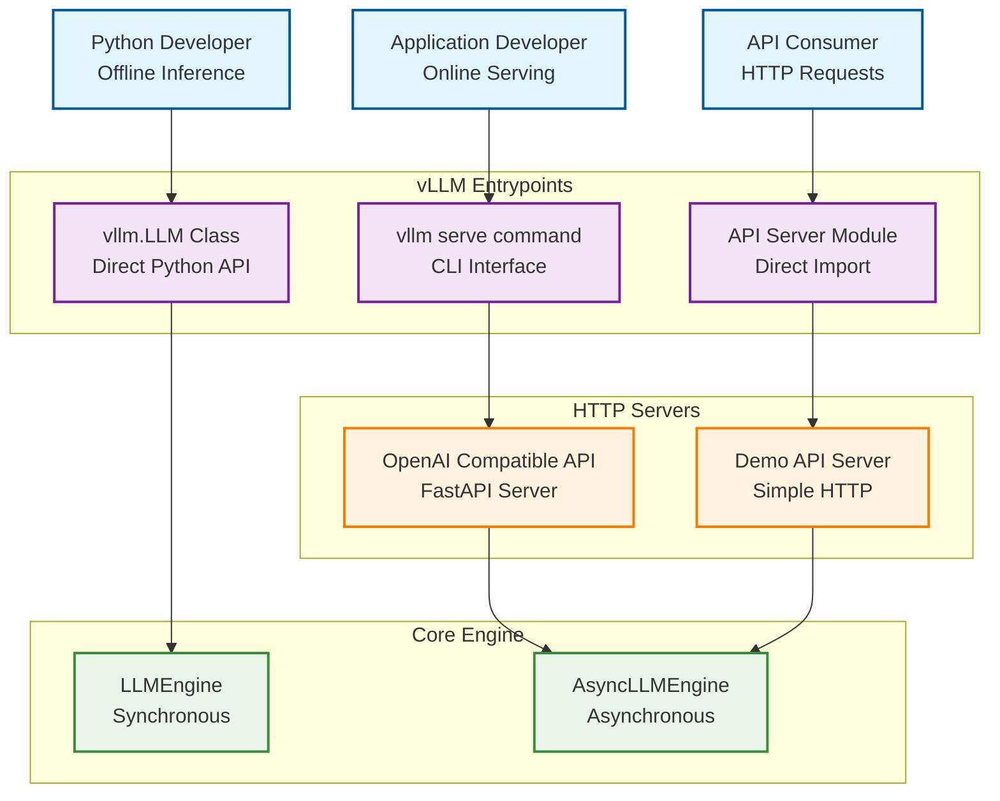
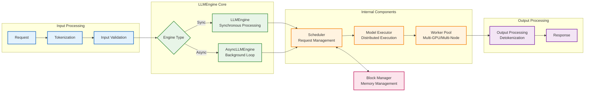
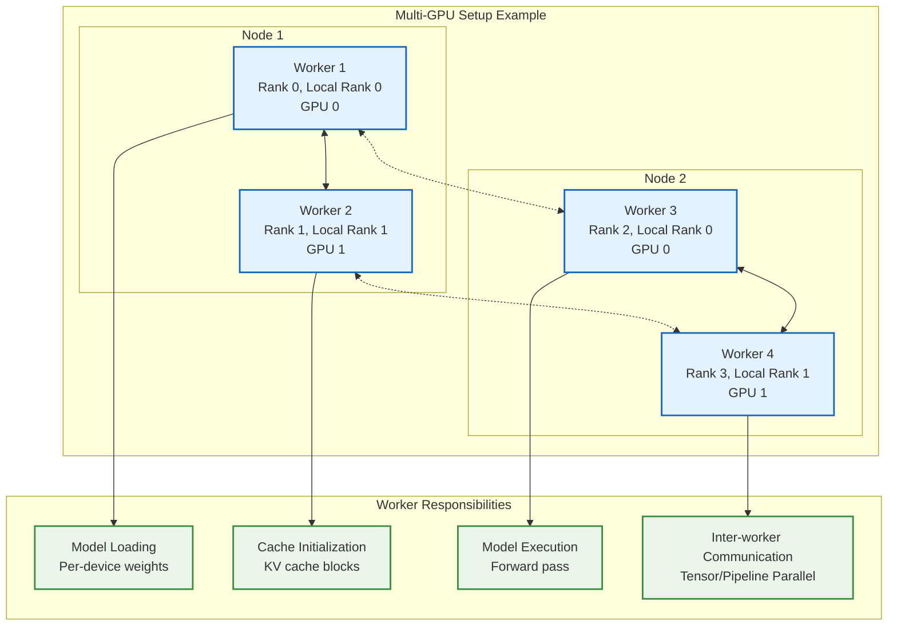
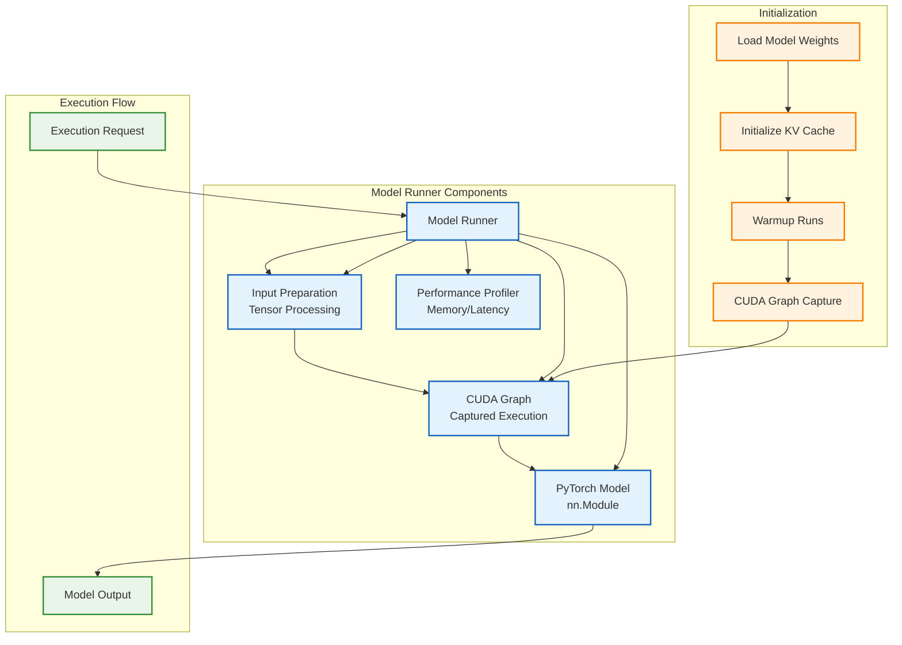

# Architecture Overview

This document provides an overview of the vLLM architecture.

[TOC]

## Entrypoints

vLLM provides a number of entrypoints for interacting with the system. The
following diagram shows the relationship between them.




### LLM Class

The LLM class provides the primary Python interface for doing offline inference,
which is interacting with a model without using a separate model inference
server.

Here is a sample of `LLM` class usage:

??? code

    ```python
    from vllm import LLM, SamplingParams

    # Define a list of input prompts
    prompts = [
        "Hello, my name is",
        "The capital of France is",
        "The largest ocean is",
    ]

    # Define sampling parameters
    sampling_params = SamplingParams(temperature=0.8, top_p=0.95)

    # Initialize the LLM engine with the OPT-125M model
    llm = LLM(model="facebook/opt-125m")

    # Generate outputs for the input prompts
    outputs = llm.generate(prompts, sampling_params)

    # Print the generated outputs
    for output in outputs:
        prompt = output.prompt
        generated_text = output.outputs[0].text
        print(f"Prompt: {prompt!r}, Generated text: {generated_text!r}")
    ```

More API details can be found in the [Offline Inference](#offline-inference-api) section of the API docs.

The code for the `LLM` class can be found in <gh-file:vllm/entrypoints/llm.py>.

### OpenAI-Compatible API Server

The second primary interface to vLLM is via its OpenAI-compatible API server.
This server can be started using the `vllm serve` command.

```bash
vllm serve <model>
```

The code for the `vllm` CLI can be found in <gh-file:vllm/entrypoints/cli/main.py>.

Sometimes you may see the API server entrypoint used directly instead of via the
`vllm` CLI command. For example:

```bash
python -m vllm.entrypoints.openai.api_server --model <model>
```

That code can be found in <gh-file:vllm/entrypoints/openai/api_server.py>.

More details on the API server can be found in the [OpenAI-Compatible Server](../serving/openai_compatible_server.md) document.

## LLM Engine

The `LLMEngine` and `AsyncLLMEngine` classes are central to the functioning of
the vLLM system, handling model inference and asynchronous request processing.




### LLMEngine

The `LLMEngine` class is the core component of the vLLM engine. It is
responsible for receiving requests from clients and generating outputs from the
model. The `LLMEngine` includes input processing, model execution (possibly
distributed across multiple hosts and/or GPUs), scheduling, and output
processing.

- **Input Processing**: Handles tokenization of input text using the specified
  tokenizer.
- **Scheduling**: Chooses which requests are processed in each step.
- **Model Execution**: Manages the execution of the language model, including
  distributed execution across multiple GPUs.
- **Output Processing**: Processes the outputs generated by the model, decoding the
  token IDs from a language model into human-readable text.

The code for `LLMEngine` can be found in <gh-file:vllm/engine/llm_engine.py>.

### AsyncLLMEngine

The `AsyncLLMEngine` class is an asynchronous wrapper for the `LLMEngine` class.
It uses `asyncio` to create a background loop that continuously processes
incoming requests. The `AsyncLLMEngine` is designed for online serving, where it
can handle multiple concurrent requests and stream outputs to clients.

The OpenAI-compatible API server uses the `AsyncLLMEngine`. There is also a demo
API server that serves as a simpler example in <gh-file:vllm/entrypoints/api_server.py>.

The code for `AsyncLLMEngine` can be found in <gh-file:vllm/engine/async_llm_engine.py>.

## Worker

A worker is a process that runs the model inference. vLLM follows the common
practice of using one process to control one accelerator device, such as GPUs.
For example, if we use tensor parallelism of size 2 and pipeline parallelism of
size 2, we will have 4 workers in total. Workers are identified by their
`rank` and `local_rank`. `rank` is used for global orchestration, while
`local_rank` is mainly used for assigning the accelerator device and accessing
local resources such as the file system and shared memory.



## Model Runner

Every worker has one model runner object, responsible for loading and running
the model. Much of the model execution logic resides here, such as preparing
input tensors and capturing cudagraphs.



## Model

Every model runner object has one model object, which is the actual
`torch.nn.Module` instance. See [huggingface_integration](huggingface_integration.md) for how various
configurations affect the class we ultimately get.

## Class Hierarchy

The following figure shows the class hierarchy of vLLM:

> <figure markdown="span">
>   { align="center" alt="query" width="100%" }
> </figure>

There are several important design choices behind this class hierarchy:

1\. **Extensibility**: All classes in the hierarchy accept a configuration object
containing all the necessary information. The [VllmConfig](https://github.com/vllm-project/vllm/blob/d1c6799b8870e513bf4f2305cbf6cda9fc3d773b/vllm/config.py#L2036)
class is the main configuration object that is passed around. The class
hierarchy is quite deep, and every class needs to read the configuration it is
interested in. By encapsulating all configurations in one object, we can easily
pass the configuration object around and access the configuration we need.
Suppose we want to add a new feature (this is often the case given how fast the
field of LLM inference is evolving) that only touches the model runner. We will
have to add a new configuration option in the `VllmConfig` class. Since we pass
the whole config object around, we only need to add the configuration option to
the `VllmConfig` class, and the model runner can access it directly. We don't
need to change the constructor of the engine, worker, or model class to pass the
new configuration option.

2\. **Uniformity**: The model runner needs a unified interface to create and
initialize the model. vLLM supports more than 50 types of popular open-source
models. Each model has its own initialization logic. If the constructor
signature varies with models, the model runner does not know how to call the
constructor accordingly, without complicated and error-prone inspection logic.
By making the constructor of the model class uniform, the model runner can
easily create and initialize the model without knowing the specific model type.
This is also useful for composing models. Vision-language models often consist
of a vision model and a language model. By making the constructor uniform, we
can easily create a vision model and a language model and compose them into a
vision-language model.

!!! note
    To support this change, all vLLM models' signatures have been updated to:

    ```python
    def __init__(self, *, vllm_config: VllmConfig, prefix: str = ""):
    ```

    To avoid accidentally passing incorrect arguments, the constructor is now keyword-only. This ensures that the constructor will raise an error if old configurations are passed. vLLM developers have already made this change for all models within vLLM. For out-of-tree registered models, developers need to update their models, for example by adding shim code to adapt the old constructor signature to the new one:

    ??? code

        ```python
        class MyOldModel(nn.Module):
            def __init__(
                self,
                config,
                cache_config: Optional[CacheConfig] = None,
                quant_config: Optional[QuantizationConfig] = None,
                lora_config: Optional[LoRAConfig] = None,
                prefix: str = "",
            ) -> None:
                ...

        from vllm.config import VllmConfig
        class MyNewModel(MyOldModel):
            def __init__(self, *, vllm_config: VllmConfig, prefix: str = ""):
                config = vllm_config.model_config.hf_config
                cache_config = vllm_config.cache_config
                quant_config = vllm_config.quant_config
                lora_config = vllm_config.lora_config
                super().__init__(config, cache_config, quant_config, lora_config, prefix)

        from packaging import version
        if version.parse(__version__) >= version.parse("0.6.4"):
            MyModel = MyNewModel
        else:
            MyModel = MyOldModel
        ```

    This way, the model can work with both old and new versions of vLLM.

3\. **Sharding and Quantization at Initialization**: Certain features require
changing the model weights. For example, tensor parallelism needs to shard the
model weights, and quantization needs to quantize the model weights. There are
two possible ways to implement this feature. One way is to change the model
weights after the model is initialized. The other way is to change the model
weights during the model initialization. vLLM chooses the latter. The first
approach is not scalable to large models. Suppose we want to run a 405B model
(with roughly 810GB weights) with 16 H100 80GB GPUs. Ideally, every GPU should
only load 50GB weights. If we change the model weights after the model is
initialized, we need to load the full 810GB weights to every GPU and then shard
the weights, leading to a huge memory overhead. Instead, if we shard the weights
during the model initialization, every layer will only create a shard of the
weights it needs, leading to a much smaller memory overhead. The same idea
applies to quantization. Note that we also add an additional argument `prefix`
to the model's constructor so that the model can initialize itself differently
based on the prefix. This is useful for non-uniform quantization, where
different parts of the model are quantized differently. The `prefix` is
usually an empty string for the top-level model and a string like `"vision"`
or `"language"` for the sub-models. In general, it matches the name of the
module's state dict in the checkpoint file.

One disadvantage of this design is that it is hard to write unit tests for
individual components in vLLM because every component needs to be initialized by
a complete config object. We solve this problem by providing a default
initialization function that creates a default config object with all fields set
to `None`. If the component we want to test only cares about a few fields in
the config object, we can create a default config object and set the fields we
care about. This way, we can test the component in isolation. Note that many
tests in vLLM are end-to-end tests that test the whole system, so this is not a
big problem.

In summary, the complete config object `VllmConfig` can be treated as an
engine-level global state that is shared among all vLLM classes.
