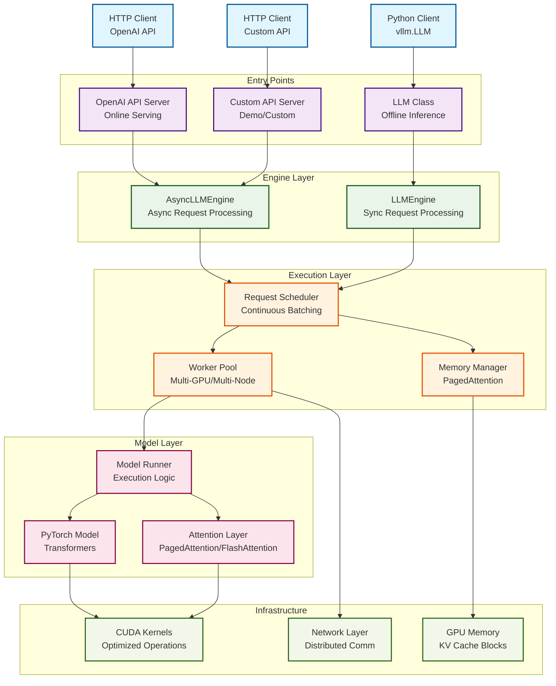
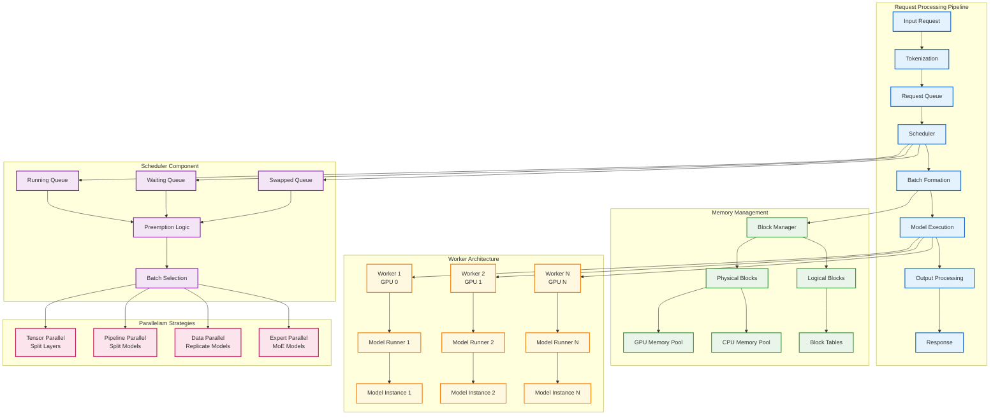
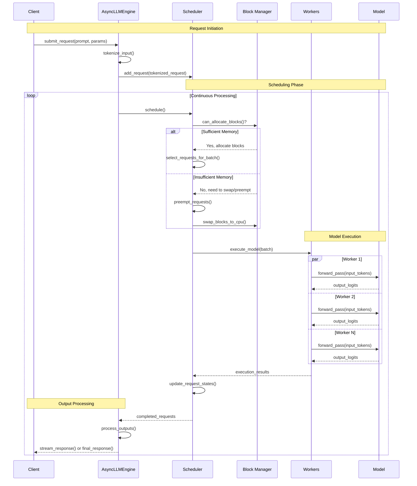
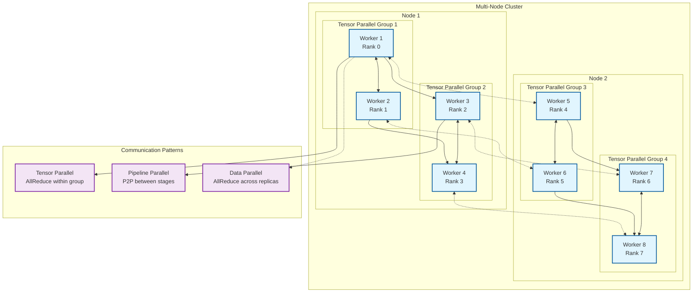
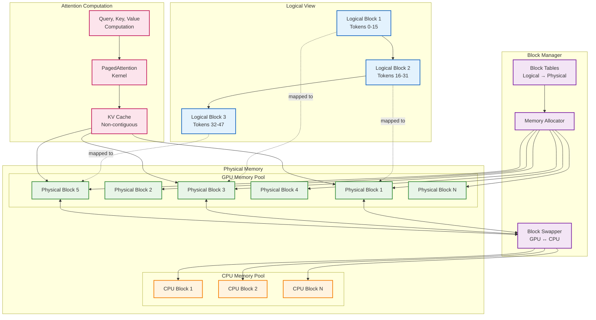
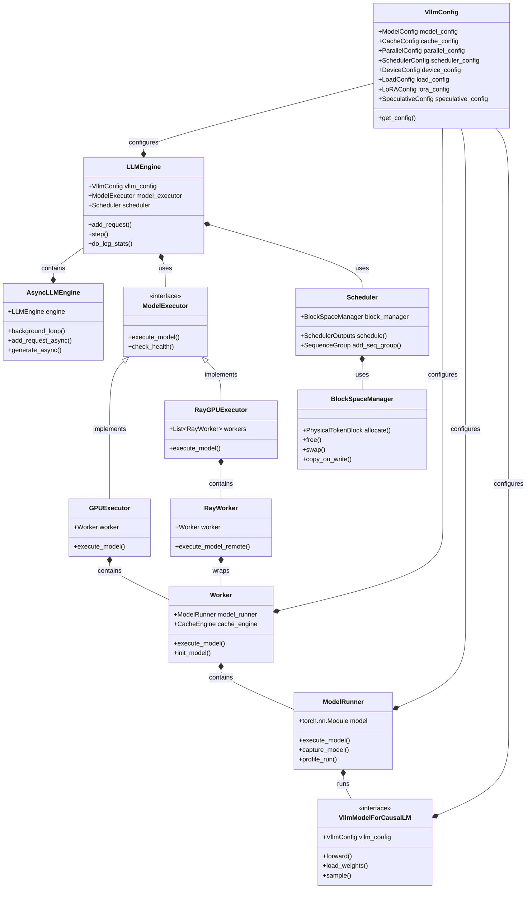
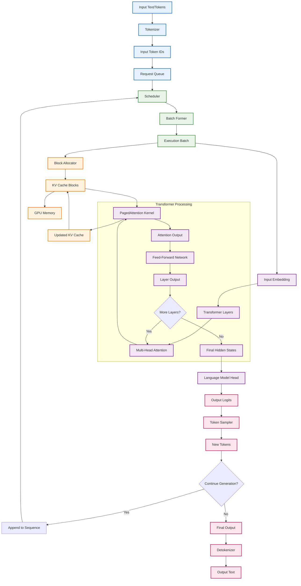
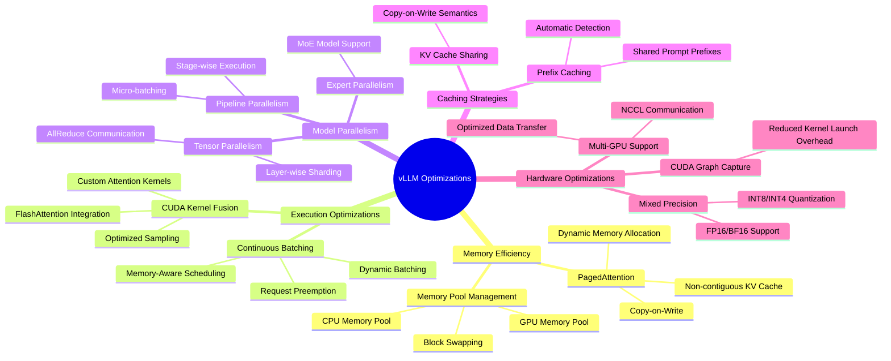
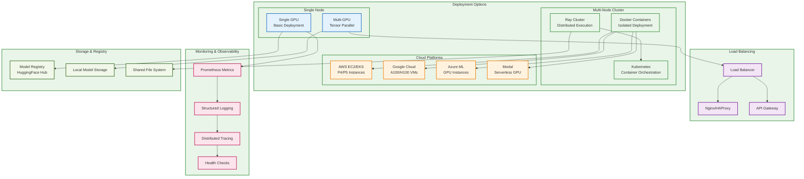

# vLLM Technical Architecture

This document provides comprehensive technical architecture documentation for vLLM, a high-throughput and memory-efficient inference engine for Large Language Models (LLMs).

[TOC]

## System Overview

vLLM is designed as a distributed, high-performance LLM serving system that efficiently manages memory and maximizes throughput. The following diagram shows the high-level system architecture:



## Core Components Architecture

The following diagram details the internal architecture of vLLM's core components:



## Request Processing Flow

This sequence diagram shows how requests flow through the vLLM system:



## Distributed Architecture

vLLM supports multiple parallelism strategies for scaling across multiple GPUs and nodes:



## Memory Management Architecture

vLLM's key innovation is PagedAttention, which enables efficient memory management:



## Class Hierarchy and Dependencies

This diagram shows the main classes and their relationships in vLLM:



## Data Flow Architecture

This diagram illustrates how data flows through the vLLM system during inference:



## Performance Optimizations

vLLM incorporates several key optimizations for high-throughput inference:



## API and Integration Points

This diagram shows the various APIs and integration points available in vLLM:

```mermaid
graph LR
    subgraph "Client Applications"
        PythonApp[Python Application]
        WebApp[Web Application]
        CLI[Command Line Interface]
        Notebook[Jupyter Notebook]
    end
    
    subgraph "API Layer"
        subgraph "Python APIs"
            LLMClass[vllm.LLM Class]
            AsyncAPI[AsyncLLMEngine]
            GenerateAPI[generate() method]
        end
        
        subgraph "HTTP APIs"
            OpenAICompat[OpenAI Compatible API<br/>/v1/completions<br/>/v1/chat/completions]
            CustomHTTP[Custom HTTP API<br/>/generate<br/>/health]
        end
        
        subgraph "Streaming APIs"
            ServerSentEvents[Server-Sent Events]
            WebSockets[WebSocket Streaming]
        end
    end
    
    subgraph "Configuration"
        ModelConfig[Model Configuration]
        ParallelConfig[Parallel Configuration] 
        CacheConfig[Cache Configuration]
        SamplingParams[Sampling Parameters]
    end
    
    subgraph "Model Integration"
        HuggingFace[🤗 Transformers Models]
        GGUF[GGUF Format]
        Quantized[Quantized Models<br/>GPTQ, AWQ, etc.]
        CustomModels[Custom Model Implementations]
    end
    
    %% Client to API connections
    PythonApp --> LLMClass
    PythonApp --> AsyncAPI
    WebApp --> OpenAICompat
    CLI --> CustomHTTP
    Notebook --> GenerateAPI
    
    %% API to streaming
    OpenAICompat --> ServerSentEvents
    CustomHTTP --> WebSockets
    AsyncAPI --> ServerSentEvents
    
    %% Configuration connections
    LLMClass --> ModelConfig
    OpenAICompat --> ParallelConfig
    AsyncAPI --> CacheConfig
    GenerateAPI --> SamplingParams
    
    %% Model integration
    LLMClass --> HuggingFace
    LLMClass --> GGUF
    LLMClass --> Quantized
    LLMClass --> CustomModels
    
    %% Styling
    classDef client fill:#e1f5fe,stroke:#01579b,stroke-width:2px
    classDef api fill:#f3e5f5,stroke:#7b1fa2,stroke-width:2px
    classDef config fill:#e8f5e8,stroke:#388e3c,stroke-width:2px
    classDef model fill:#fff8e1,stroke:#f57c00,stroke-width:2px
    classDef streaming fill:#fce4ec,stroke:#c2185b,stroke-width:2px
    
    class PythonApp,WebApp,CLI,Notebook client
    class LLMClass,AsyncAPI,GenerateAPI,OpenAICompat,CustomHTTP api
    class ModelConfig,ParallelConfig,CacheConfig,SamplingParams config
    class HuggingFace,GGUF,Quantized,CustomModels model
    class ServerSentEvents,WebSockets streaming
```

## Deployment Architecture

vLLM supports various deployment configurations from single GPU to multi-node clusters:



## Conclusion

This technical architecture documentation provides a comprehensive overview of vLLM's design principles, core components, and system interactions. The modular architecture enables high performance, efficient memory utilization, and flexible deployment options while maintaining extensibility for future enhancements.

Key architectural highlights:
- **Memory Efficiency**: PagedAttention enables non-contiguous KV cache storage with dynamic allocation
- **High Throughput**: Continuous batching and optimized CUDA kernels maximize GPU utilization
- **Scalability**: Support for tensor, pipeline, and data parallelism across multiple nodes
- **Flexibility**: Multiple API interfaces and deployment configurations
- **Extensibility**: Plugin system and uniform configuration management

For implementation details of specific components, refer to the individual design documents in the `/design` directory.